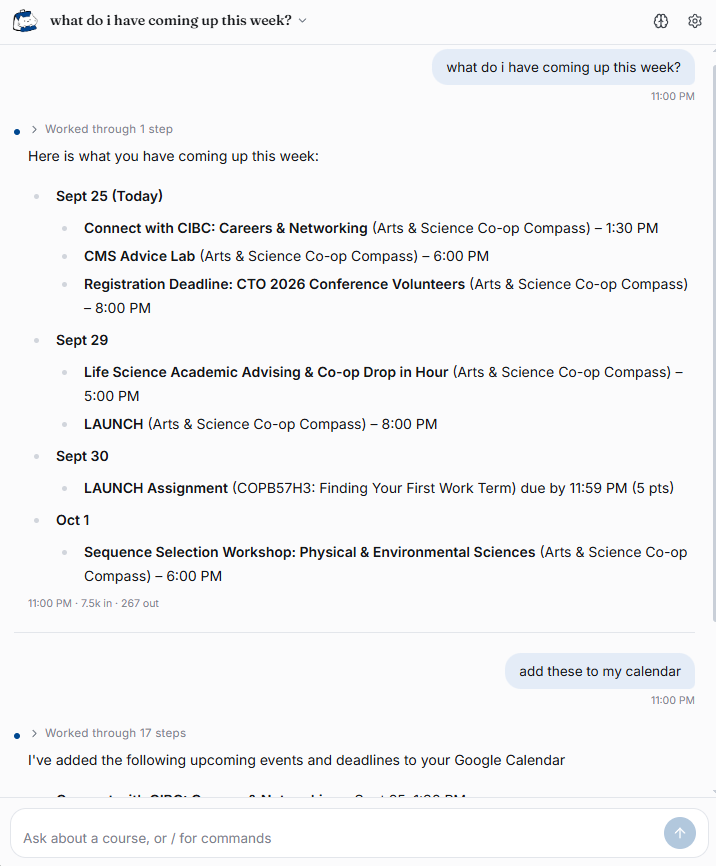

# CanvasBuddy


## What it is

CanvasBuddy is an AI agent for Canvas that lives in your browser's side panel (the sidebar, in Firefox).

It works with any Canvas site. There is no server and no account to create. It uses the Canvas session you are already logged into, and you bring your own Gemini or OpenAI API key. Everything it learns stays in your browser.

It can also use your other tools, like Notion or Google Calendar, through connections you add yourself.

## What it can do

Ask it things like:

- What do I have due this week? What am I missing?
- Where are the lecture 5 slides for my stats course?
- What did lecture 8 say about the central limit theorem?
- Summarise the grading scheme in the syllabus.
- Is the midterm open book? How long is the quiz and how many attempts do I get?
- What was the last announcement in my algorithms course?
- Did anyone on the forum ask about question 3 of the problem set?
- What did my TA say in their last message?
- Read me pages 4 to 6 of the week 2 notes.
- Put this week's lecture notes on a new page in my Notion.
- Add my upcoming deadlines to my calendar.

CanvasBuddy seamlessly navigates, learns, answers, remembers.



## Design philosophy

A few ideas shape the design of CanvasBuddy.

**Local first.** There is no backend. The database, file index and the agent loop all run in the extension itself. Canvas is reached with the cookies your browser already has, so no Canvas token is stored anywhere. You bring your own API key, and own your data.

**Lazy by default.** Nothing is fetched or computed until something needs it. Courses are listed when you ask about them, a course's modules when it is explored, a document's text when it is first read or searched, an assignment's description on first access, a discussion's replies when a thread is opened. Embedding is the strictest case: no sync ever calls the embedding API, and a document is embedded only when a semantic search is about to look through it. This keeps first use fast and your API bill proportional to what you actually ask.

**Maximal caching, engine owned.** Everything the assistant reads comes from a local copy of your Canvas. The Canvas API is only hit when a freshness engine determines required information is missing or outdated. The model never works with the Canvas API directly.

**A minimal toolset.** Eight tools, each a thin read over the local graph, rather than one tool per Canvas endpoint. Less tools and ambiguity reduces hallucinations while maintaining functionality.

**Bring your own tools.** Anything beyond Canvas comes from connections you add. A connection is only a server address and a sign-in: no code is downloaded, and nothing is built in for any one service. The assistant asks before it changes anything in a connected service, and it never writes to Canvas.

## Technical overview

**Persistent memory.** A Postgres database compiled to WebAssembly (PGlite, with pgvector) persisted in IndexedDB. It holds thin mirrors of Canvas listings (courses, modules and items, assignments and your submissions, pages, files, announcements, discussions, quizzes, planner, inbox), a link graph between them, document text and vectors, and a sync stamp per collection. Chats and settings live in localStorage.

**Freshness engine.** Before a tool reads a collection, the engine checks its stamp. Each collection has a maximum age you can edit in Settings. Within that age, collections Canvas offers a cheap change check for (modules, announcements, discussions, inbox, home page, syllabus) are probed and refetched only if something moved, and only the parts that moved. Past it, a full sync runs, which is also what catches deletions. Collections a course hides from students are remembered as unavailable and not retried for a day. Concurrent requests for the same collection share one fetch.

**Just in time indexing and hybrid search.** The first question about a document downloads it, extracts text per page or slide, groups small slides so every chunk has enough context, embeds the chunks (768 dimensions) and stores them with a full text index and an HNSW vector index. Search fuses vector similarity with Postgres full text ranking, because course material is full of exact tokens like "Theorem 3.2" where keywords win and paraphrased questions where embeddings win. Every chunk remembers the page range it covers, which the model cites instead of guessing. When a document changes upstream, only chunks whose text changed are re-embedded. Inbox and discussion threads are stored as text when they sync and embedded only when a semantic search targets them.

**Link markers.** Document text keeps its links as short markers, like `[file 44541003]` or `[page week-1]`, so the assistant can follow a link from the syllabus to the file it names, or give you the URL.

**Agent loop.** Supports Gemini and OpenAI models, and OpenAI compatible endpoints. Tool turns are persisted, capped, and summarised into digests when the conversation grows past your threshold.

**Rendering.** Replies are Markdown with LaTeX. Because their text derives from content other people wrote on Canvas, they are sanitised through an allowlist before they reach the page, and math is rendered by KaTeX after sanitising.

**Connections.** A connection is a remote MCP (Model Context Protocol) server. CanvasBuddy speaks MCP over Streamable HTTP, signs in with OAuth (discovery, dynamic client registration and PKCE, in a browser sign-in window) and refreshes tokens on its own. A service's tools are offered to the model next to the built-in ones. When additional tool definitions exceed a configurable count/token size, tools are lazily loaded through semantic search by the model rather than dumped (keyword ranking over their names and descriptions). Tools the server does not mark as read-only wait for your approval. Tokens are kept in the extension's own storage, separate from your Canvas data.

The full architecture reference is in [`reference/`](reference/README.md).

## Connections

Open **Settings → Connections** to add one.

- **Notion** connects in one click, then asks you to sign in to Notion.
- **Google Calendar, Gmail and thousands of other apps** are reachable through an aggregator you have an account with, such as **Zapier** or **Composio**. Create an MCP server in their dashboard, choose which actions to allow, and paste its URL.
- **Anything else** that offers a remote MCP server (its URL usually ends in `/mcp`) can be added by URL.

Each connection shows its tools. You can switch individual tools off, see how large they are, and choose which ones may run without asking. When the assistant wants to change something in a connected service, the step in the chat shows exactly what it will send, with **Allow**, **Always allow** and **Deny**.

What the assistant sends to a connected service (a search, a page it writes for you) goes to that service under your account there; aggregators like Zapier and Composio also hold your sign-in to the apps behind them.

## Build and install

CanvasBuddy builds for Chrome (and other Chromium browsers like Edge) and for Firefox 128 or later, from the same source.

```bash
cd extension
npm install
npm run build           # Chrome / Edge → extension/dist
npm run build:firefox   # Firefox       → extension/dist-firefox
```

**Chrome / Edge**

1. Open `chrome://extensions`, turn on Developer mode, choose **Load unpacked**, and pick `extension/dist`.
2. Open your Canvas site in a tab and sign in.
3. Click the CanvasBuddy icon in the toolbar. The side panel opens. A known Canvas connects on its own; any other site shows a **Grant access** button once.
4. Open Settings in the panel and paste your Gemini or OpenAI API key.

**Firefox**

1. Open `about:debugging`, choose **This Firefox**, then **Load Temporary Add-on…**, and pick `extension/dist-firefox/manifest.json`. A temporary add-on is removed when Firefox closes; load it again next time.
2. Open your Canvas site in a tab and sign in.
3. Click the CanvasBuddy icon in the toolbar. CanvasBuddy opens in the sidebar; clicking the icon again closes it. A known Canvas connects on its own; any other site shows a **Grant access** button once.
4. Open Settings in the panel and paste your Gemini or OpenAI API key.

Firefox lets you withdraw any site access from the add-on's **Permissions** tab in `about:addons`. If you do, CanvasBuddy shows the **Grant access** screen again.

**Please note that CanvasBuddy was only tested using gemini models and the University of Toronto's Quercus**
